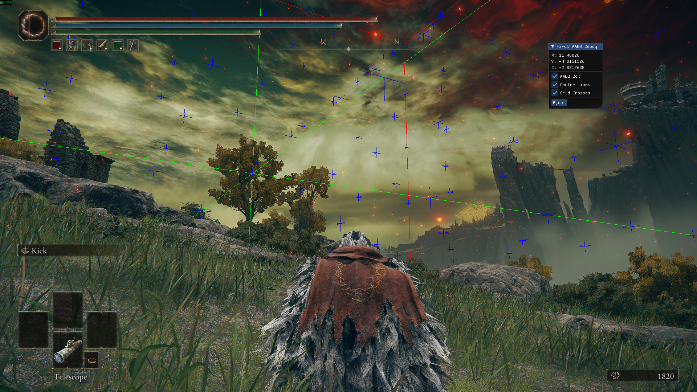
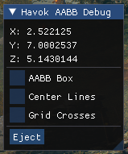

# Elden Ring Havok Physics Coordinate AABB Tool
Elden Ring tool to visualize the Havok Physics Coordinates AABB.

Only tested on v1.16.1, but might work on other versions?

## How to use
Run the game with EAC disabled. Then run the EXE to inject the DLL. Afterwards, a popup will appear in-game.

In it, you can see the players havok physics XYZ coordinates.

Additionally, you can toggle individual AABB visualizations:
- The current box itself in red.
- Axis going through the center point of the box in green.
- Possible positions for the box to shift to on an 8-unit grid in blue.

You can also eject/close the tool.